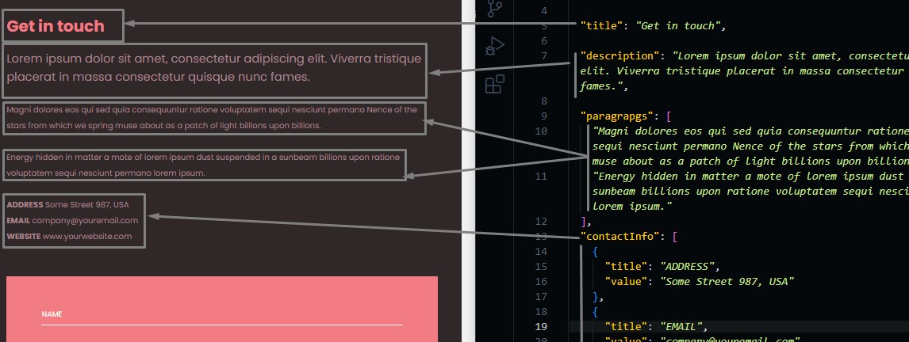
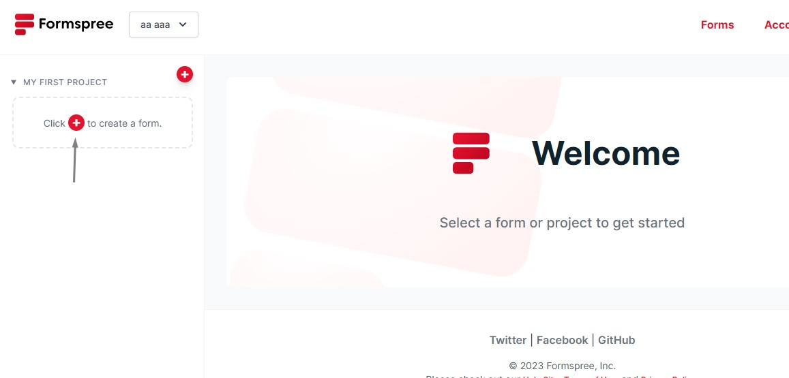
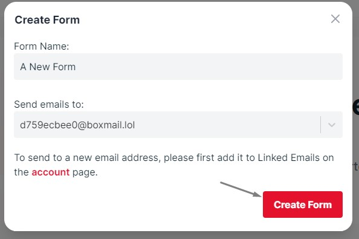
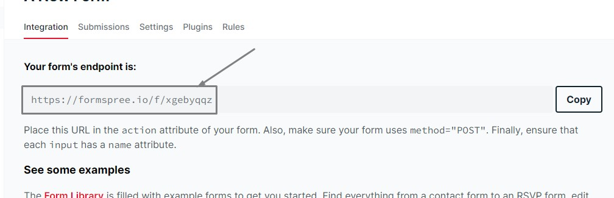
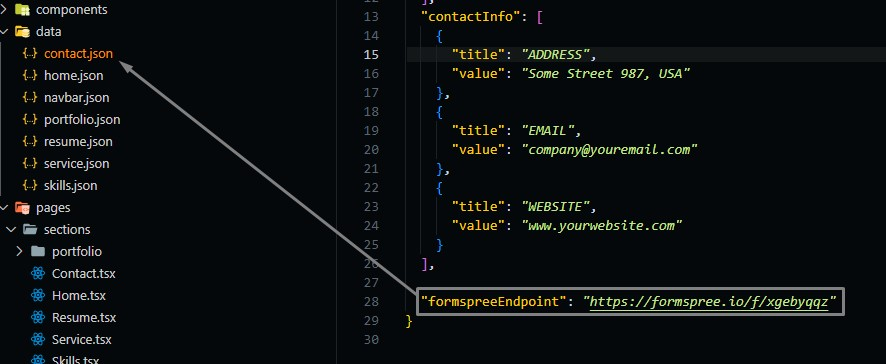

# Contact Section

Go to `./src/data/contact.json` file, and open it.

## Changing Contact Text

Contact section consists of.

- title
- description of the section
- paragraphs (more than one paragraph about the section)
- contact information (Your contact informations)

```json
{
  "title": "section title",
  "description": "section short description",
  "paragraphes": [
    "some text",
    ...
  ],
  // Your contact information
  // You can add more than one, its up to you
  "contactInfo": [
    {
      "title": "ADDRESS",
      "value": "Your address"
    },
    ...
  ],
}
```



## Contact Form Activation

We used formspree API to receive messages via email, Make the following steps to activate the contact form and make messages sent to your email inbox.

- Goto [formspree](https://formspree.io/) and sign up with the email you want to receive messages on it.
- Activate your account and open your home page.
  
- Create a new form endpoint.
  
- Take Your endpoint from the website.
  
- Put your endpoint in `contact.json` file.
  
