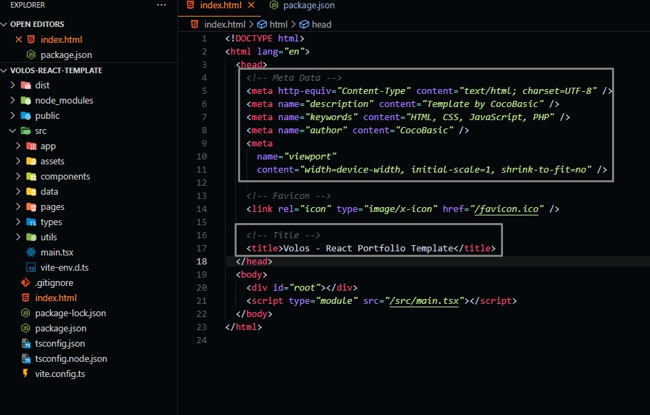
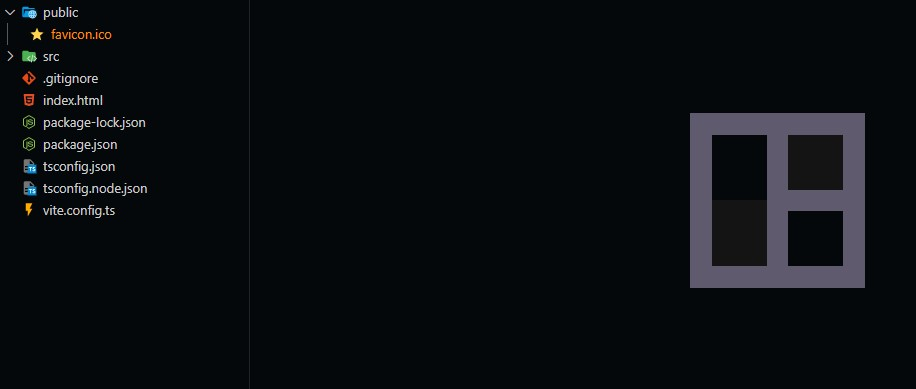
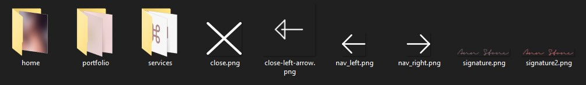
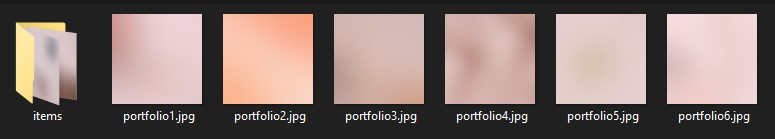

# Global Customizations

We will start by customizing and editing the global data of the template.

## Change Title and Metadata

You can change the title and metadata of the template from index.html page.

## Change Favicon

Go to `./public` and you will find `favicon.ico` You can change it with the image you need.

## Change Images

You can change images by going to `./src/assets/images`, and you will find different folders, each folder is for a given section on the main template page.

Your image dimensions should be exactly as the image you want to replace and then you can replace images.

For example, if you opened the portfolio folder, you will find six images, you can replace these images with the images you will use.

:::caution
Don't change the name of the images as this will cause errors.
:::

