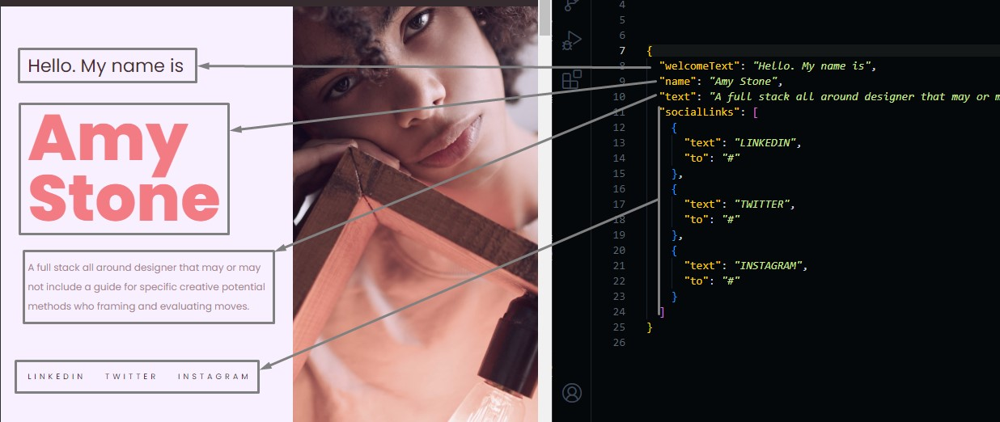

# Home Section

Go to `./src/data/home.json` file, and Open it.

You will find the data we used in the home section, and you can edit it from this file.

```json
{
  "welcomeText": "intro text",
  "name": "your name",
  "text": "some short description about your self",
  "socialLinks": [
    {
      "text": "social media platform name, i.e: twitter",
      "to": "social media platform link, i.e: https://www.twitter.com"
    }
    ...
  ]
}
```



You can add, delete or edit social media platform page by the same way we added nav link (in navbar customization)
