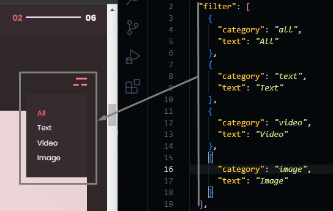
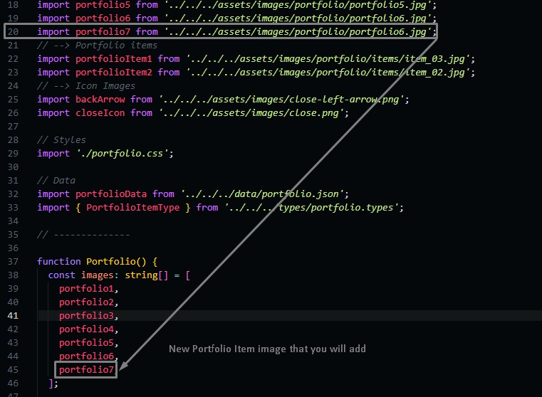
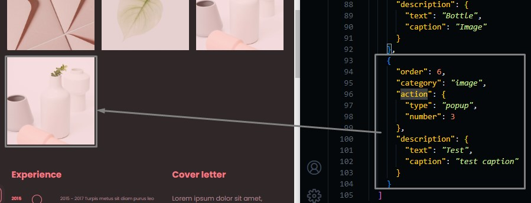
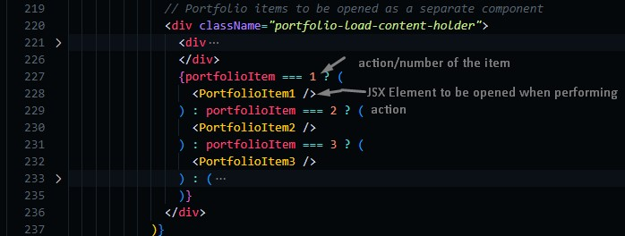
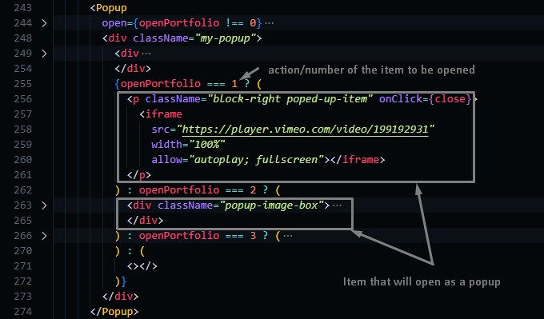
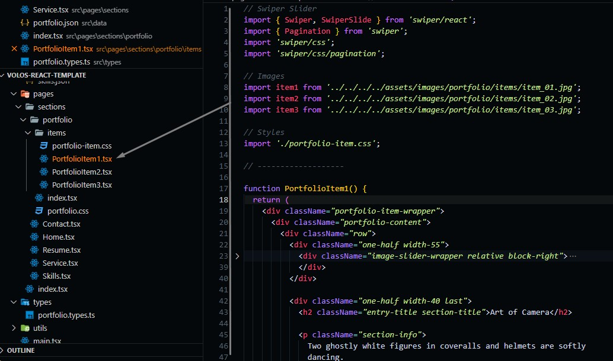

# Portfolio Section

Take care when changing this part as it's the hardest part to be modified.

Go to `./src/data/portfolio.json` file, and open it.

## Changing Portfolio Items Filter

When applying one filter option, you can change how portfolio items are filtered (which item show and which item hide).

```json
{
  "filter": [
    {
      // Portfolio items that contains this category will show when applying filter
      // word {all} is reserved to show all items
      "category": "all",
      // text to be shown
      "text": "All"
    }
  ]
}
```



## Changing Portfolio Item

We don't prefer adding items in this section by yourself if you are a beginner as it may be complicated, but we will try to make it easy for users to change this part.

### Editing Portfolio Item

To edit item you need to take care of item options where each item has some options, some of them is free to edit and other are not, we will write a schema to make it more clear.

```json
  "portfolioItems": [
    {
      // order of the item (we start from 0), next item must have (the order of the previous item + 1)
      "order": 0,
      // the category of the item, it should match one of filter values that we discussed before this
      "category": "text",
      // Action that will occur when clicking on the item,
      // It can be opened as a new page or as a popup
      "action": {
        "type": "item => open new page on clicking, popup => open a popup when clicking",
        // number of items (you should arrange items with the same action/type ascendingly)
        "number": 1
      },
      // Description text of the item
      "description": {
        "text": "text preview",
        "caption": "caption text"
      }
    },
    ...
  ]
```

### Adding Portfolio Item

Before adding you should add an image for that new item you will add (we discussed this in the service section)



Then you can add the item you want to add.



After adding the new item you will have to activate the action.

**action/type = item**: go to `./pages/sections/portfolio/index.tsx` then add the new page you want to be opened



**action/type = popup**: go to `./pages/sections/portfolio/index.tsx`



## Item Component

In `./items` you will find tsx files, each of them represents a jsx component to be rendered when clicking on a portfolio item with action/type == "item".

If you want to edit those items you can go to one of them and edit the content of it.

:::info
These items can only be edited through their tsx file, and if you want to add new items (as we said in the Adding Items), you need to put the portfolio item content you need, or you can use the template we used in one of the three items that we have put as a demo.
:::


