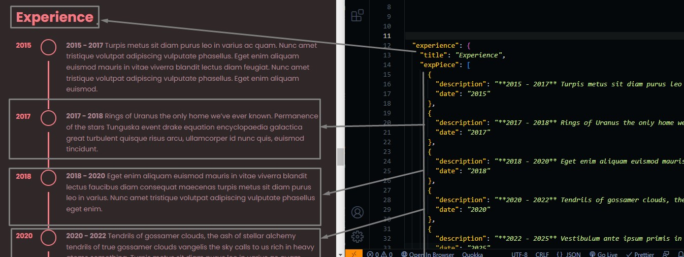

# Resume Section

Go to `./src/data/blog.json` file, and open it.

## Changing Resume Experience

```json
{
  // Title to be shown
  "title": "Experience",
  "expPiece": [
    {
      // Short text about That expereince
      "description": "description of the history of the given experience",
      // Date of the expereince
      "date": "2015"
    },
    ...
  ]
}
```

You can add more experiences or delete some of them, we added adding and deleting processes a lot so it should be easy for you now to edit and delete an array of items.



## Changing Cover Letter

```json
{
  "coverLetter": {
    "title": "Cover letter",
    // Short description about yourself
    "description": "some text",
    // some paragraphes you want to talk about your self.
    // You can add more than one paragraph, its up to you.
    "paragraphes": ["some text", "some text"]
  }
}
```


