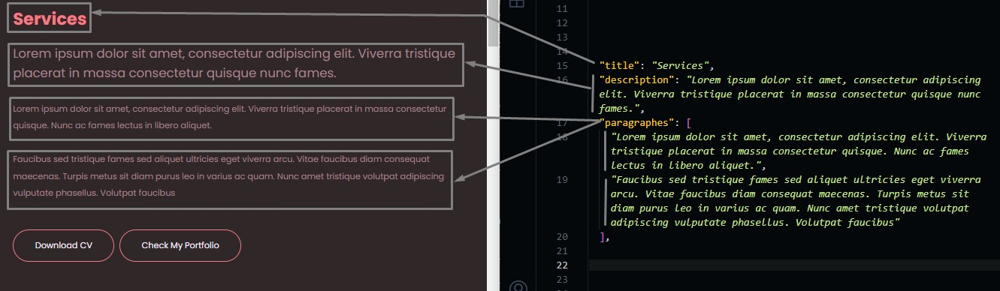
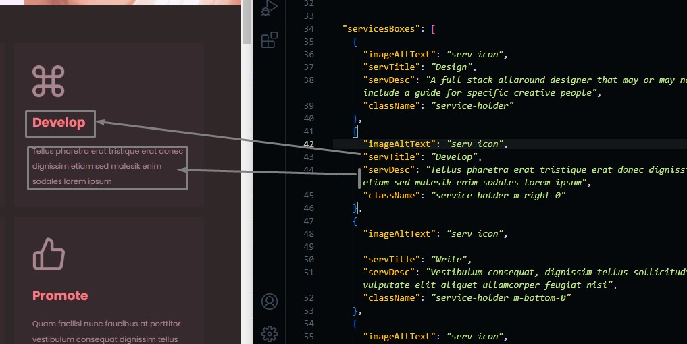
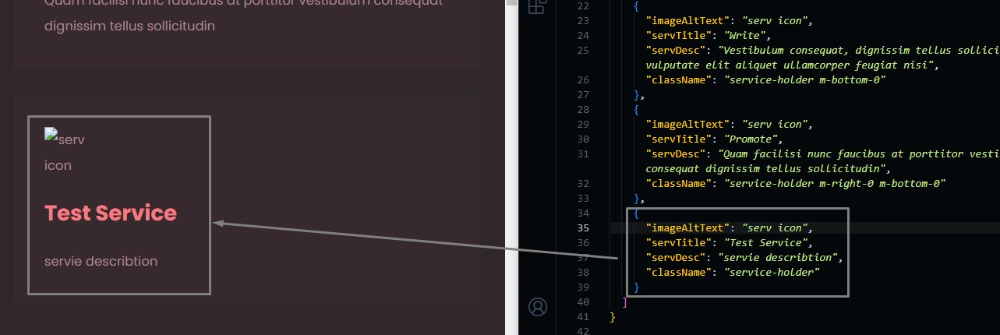
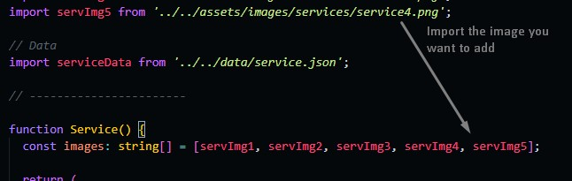

# Service Section

Go to `./src/data/services.json` file, and open it.

## Changing Section Text

Change the text in the file and the preview text in the template will be changed.

```json
{
  "title": "section title",
  "description": "short description",
  "paragraphes": [
    "paragraphe 1",
    "paragraphe 2",
    ...
  ]
}
```



For paragraphs that existed in the array, you can add more paragraphs or reduce them as you need, and they will be added to the template.

## Services Boxes

```json
{
  "servicesBoxes": [
    {
      "imageAltText": "alt text of the service image",
      "servTitle": "service title",
      "servDesc": "service short description",
      "className": "don't change this!"
    },
    ...
  ]
}
```



### Adding Service

If you want to add a service all you need to do is to copy one service Object in `services.json` file and add it to the servicesBoxes array, and here is an example.



As you can see in the image, the new service appeared but the problem is that there is no image.

go to `./src/pages/sections/Service.tsx` and add the new image.



:::info
Number of services should be equal the number of images in images array.
:::
