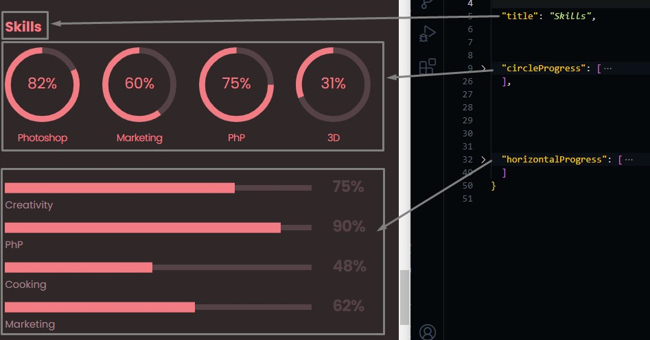
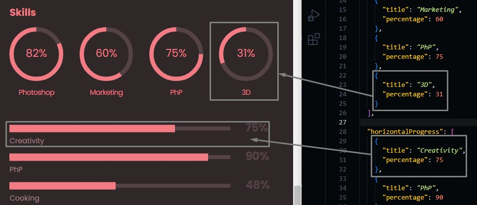

# Skills Section

Go to `./src/data/skills.json` file, and open it.

Skills section consists of.

- title
- circular progress
- horizontal progress



## Changing Skills Progress

Changing progress percentage in either circular or horizontal progress is done by the same way.

```json
{
  // Skill title
  "title": "Marketing",
  // Percentage of your expertise in this technology
  "percentage": 75
}
```



### Add/Delete Skill Progress

You can add or delete skill progress by adding new ones in the same way we learned before.
