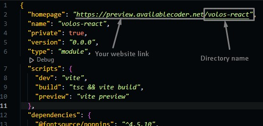
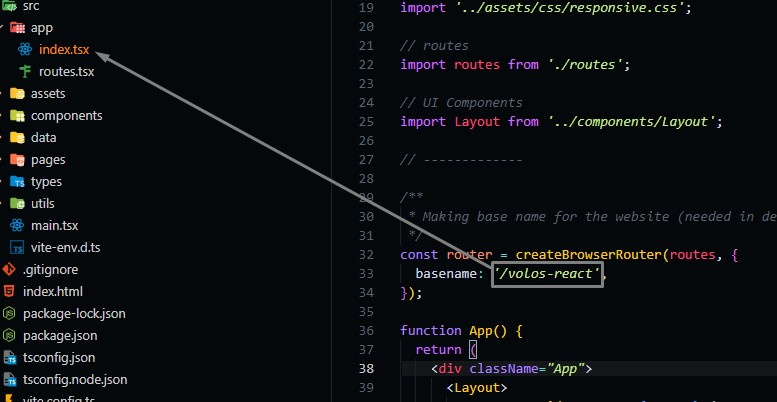
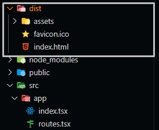

# Deploying Website

After finishing customizations and editing the website, it's time to learn how to deploy the website.

:::info
You may face some difficulties in the deployment process and this is normal, we will try to make it simple for you, but it's better to let someone deploy your website.
:::

## Preparing Website

There are some steps we will do before building the website.

- Change the homepage property to your website link from `package.json` file
  
- Goto `./src/app/index.tsx` and change **volos-react** to the directory you wrote before in the `package.json` If there is no directory then make the basename equal **/**
  

## Building Website

After doing the previous steps, it's time to build the website.

Write `npm run build` in the cmd and you will find a folder named `dist` created.

```bash
npm run build
```



The folder created `dist` is the folder that we will use and upload to the server.

## Shared Hosting

Make a folder in `public_html` named equal to the directory name you wrote in the `package.json` file and extract dist files.

:::caution
Don't put the dist folder itself put the files inside it in the folder you created
:::

## Any Hosting

Deploying process may change from one hosting provider to the other, and the type of hosting plan too, and you may need to do further modifications to host the website on the provider you want.

We will leave a blog on how to upload `Static Sites` on different hosting provider.

---

[Deploying a Static Site | Vite](https://vitejs.dev/guide/static-deploy.html)
